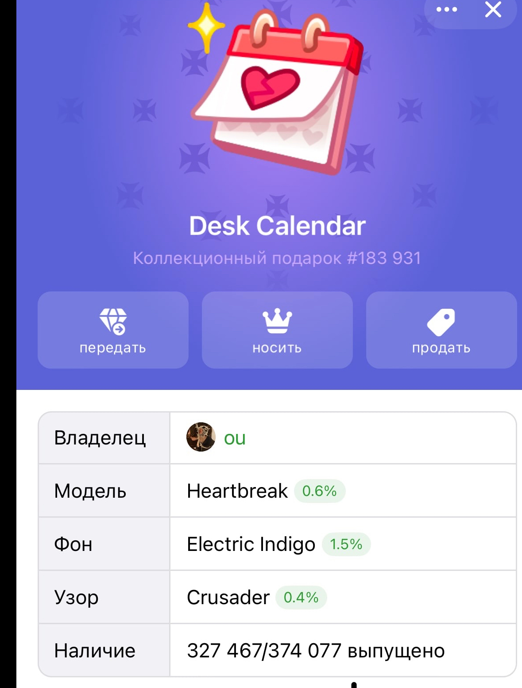
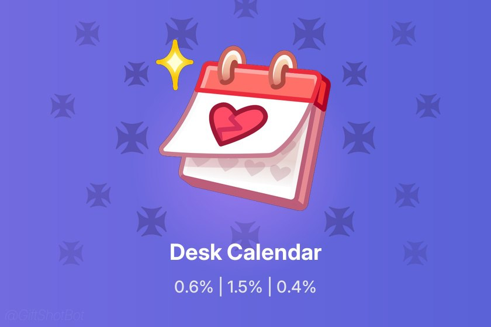

## Как красиво оформить NFT-подарок в Telegram и зачем это вообще нужно

NFT-подарки в Telegram — интересный и растущий формат, который становится частью Web3-культуры. Их можно дарить участникам сообществ, друзьям, коллегам, а в некоторых случаях они становятся элементами геймификации, подписок или промо-акций. Ценность таких токенов может варьироваться от символической до вполне ощутимой. Но есть одна вещь, о которой часто забывают — внешний вид.

### Что не так с оформлением подарков в Telegram

На первый взгляд, NFT-подарок — это просто. Вы нажали пару кнопок, выбрали получателя и отправили токен. Но если вы захотите поделиться этим подарком в соцсетях, показать его в блоге или просто сохранить в коллекцию, обнаружите проблему: визуал выглядит не очень.

В Telegram всё оформлено утилитарно. Блеклый фон, служебные значки, кнопки и анимации, которые легко обрезать или потерять при скриншоте. Итог — теряется ценность, уникальность, да и просто эстетика подарка. Особенно если подарок редкий, а на картинке это совсем не видно.

>     
> _Как обычно выглядит NFT-подарок в Telegram. Много служебных элементов, нет редкости, визуально — обычная карточка._

### Что с этим можно сделать

Некоторые энтузиасты сохраняют изображение вручную, открывают фоторедактор и добавляют подписи, рамки, нужную информацию. Это помогает, но отнимает время. Особенно если оформлять нужно не один подарок, а несколько — например, для поста в канале или дайджеста коллекции.

Я столкнулся с этой проблемой сам. Хотел сделать аккуратную подборку NFT, но устал вручную всё вырезать и форматировать. Тогда и возникла идея — упростить оформление и сделать его доступным через Telegram.

### Как работает автоматизированное решение

Для этого я собрал простого Telegram-бота — он называется **Gift Shot Bot**. Суть в следующем: вы копируете ссылку на NFT-подарок и отправляете её боту. В ответ он возвращает картинку в хорошем качестве, без лишних кнопок и визуального шума.

>    
> _Вариант с оформлением: указано название, редкость, аккуратная обрезка и сохранён стиль Telegram._

Можно выбрать разные стили: показать только арт, добавить надпись с названием и редкостью, указать владельца. Картинка сохраняет оригинальное качество и подходит как для личной коллекции, так и для публикаций.

>   
> _Чистый арт без лишнего — удобен для оформления и презентаций._

### Почему это важно

NFT — это не только про технологии, но и про эстетику. Если цифровой подарок оформлен небрежно, он теряет часть своей ценности. Визуальная подача — важная часть восприятия, особенно в контексте публичных дропов, коллекций или блогов. Оформление помогает сделать подарок понятным и привлекательным.

Автоматизация таких задач — это способ сэкономить время и сохранить качество. И всё это без регистрации, прямо внутри Telegram.

🔗 **Попробовать сейчас**: [Gift Shot Bot в Telegram](https://t.me/GiftShotBot?start=github)

---

### 🔑 Нас находят по таким запросам:

- как оформить nft подарок в telegram  
- как красиво оформить nft в телеграм  
- скрин nft telegram без кнопок  
- как сохранить nft подарок красиво  
- nft подарок без интерфейса telegram  
- telegram nft frame generator  
- как сделать nft подарок красивым  
- генератор nft превью telegram  
- nft подарок не влезает в экран  
- редкость nft telegram оформить
